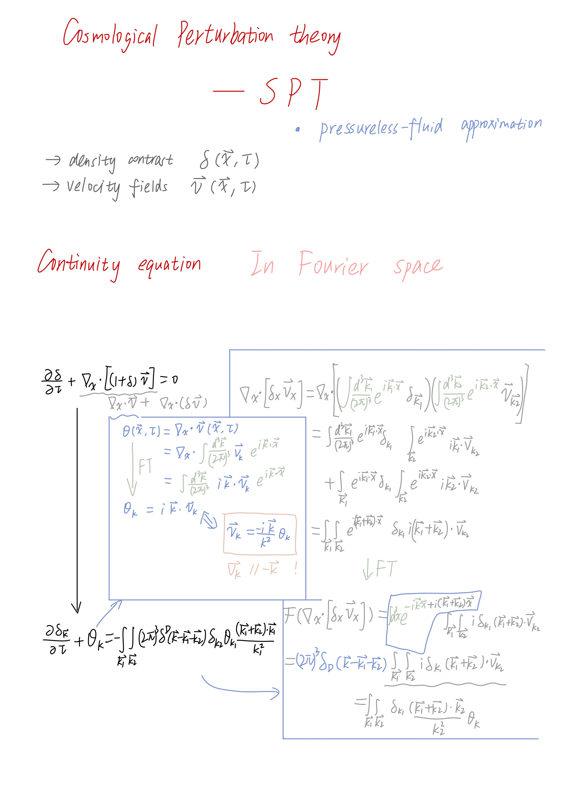
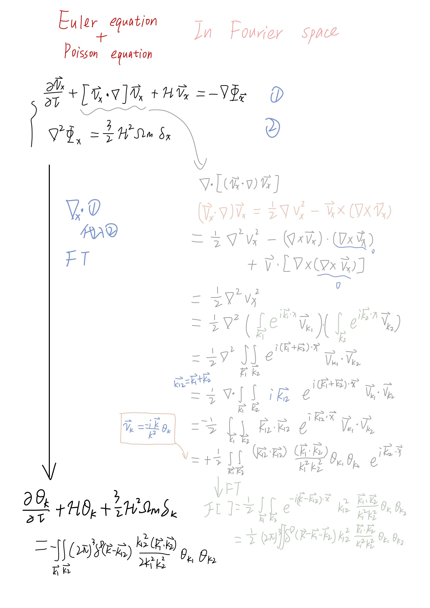

# Cosmological SPT 中 将演化方程写到傅立叶空间

我们想要用微扰的方法研究 dark matter density contrast $\delta({\bf x}, \tau)$ 和 velocity ${\bf v}({\bf x}, \tau)$ 两个场在 nonlinear gravitational evolution 下的时间演化方程。

在 pressure-less fluid 的近似下，演化方程是 1. 连续性方程(continuity)，2. Euler 方程，和 3. Poisson 方程。

在傅立叶空间中的 $\delta({\bf k}, \tau)$ 和 ${\bf v}({\bf k}, \tau)$ 的演化方程的推导如下所示。

注意第二页用到了 速度场无旋 的条件。还用到了不太 trival 的 nabla矢量分析公式。

---

我们的推导适用于以下文献：
- Desjacques, Jeong, Schmidt, 2019, Large Scale Bias, review, B1-3 到 B4-5 的推导。